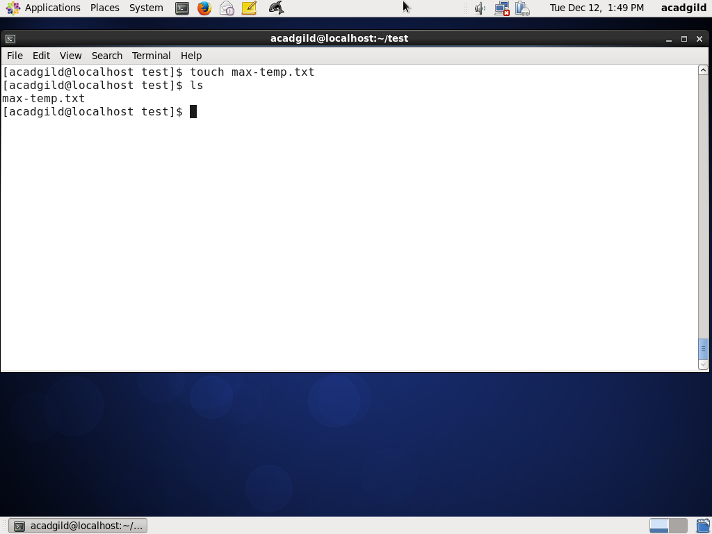
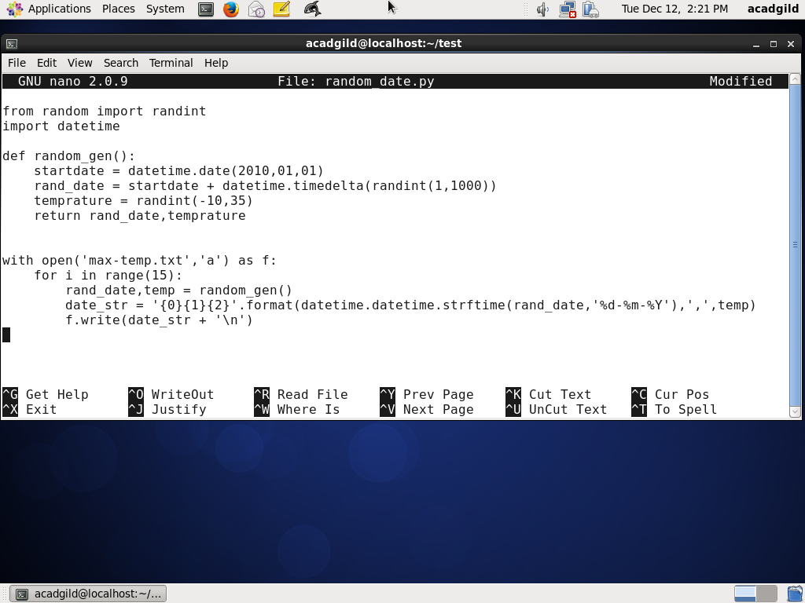
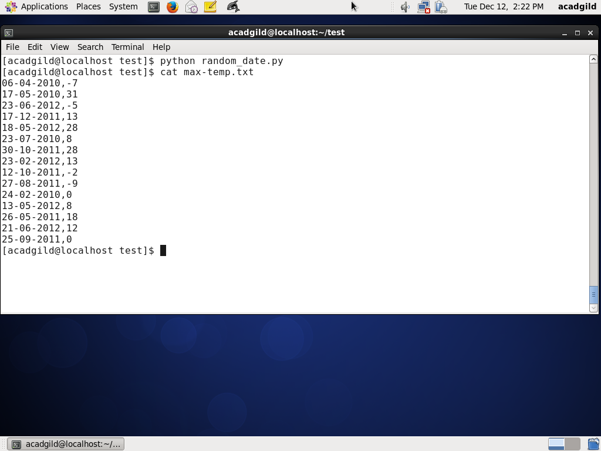
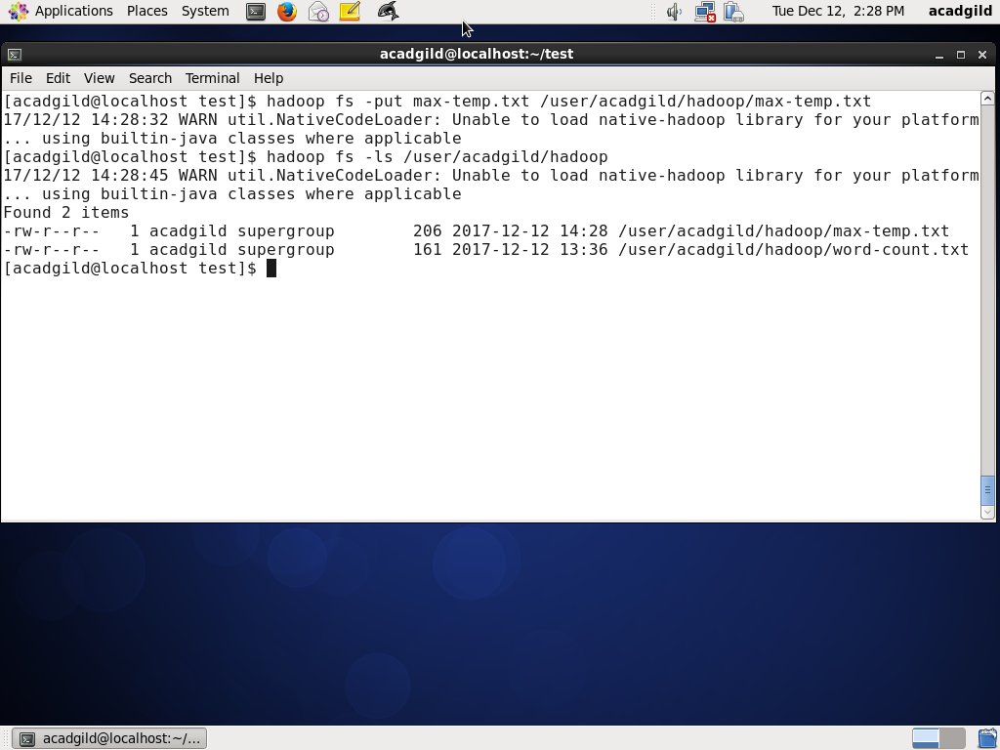
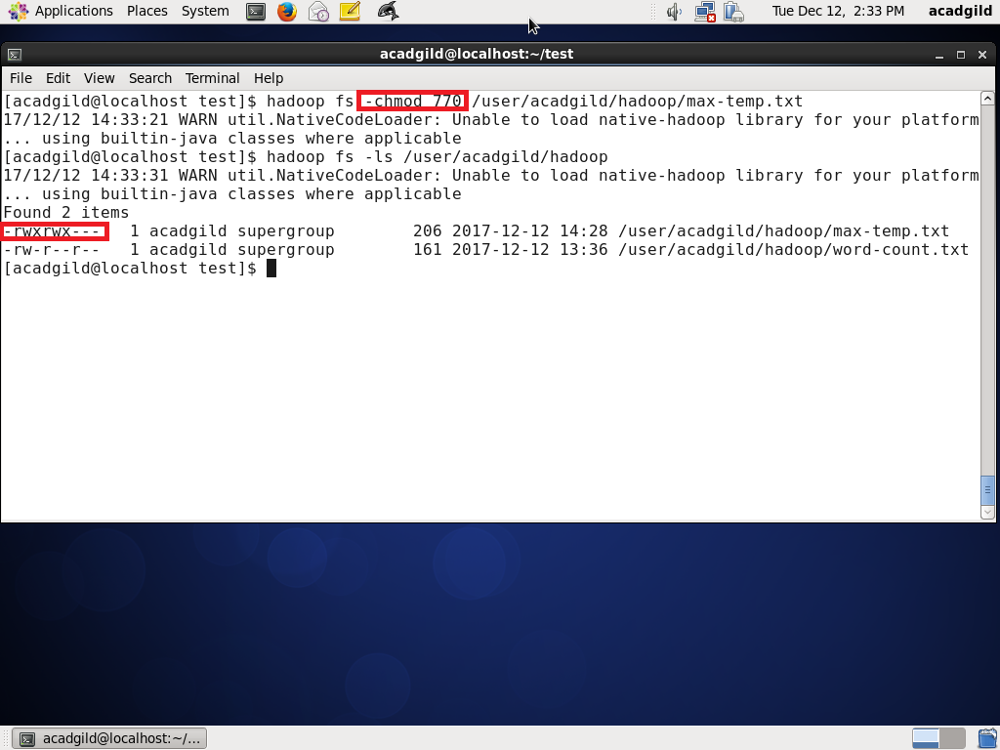

## Basic Hadoop commandline.
* In this exercise we will create max-temp.txt file and move this file into hadoop filesystem. We also try to change the permission of max-temp in hadoop file system.

---

### Create file

* Create max-temp file using **touch**

---

### Python script to write information file.

* Create python script to generate random date and temprature, and write this numbers in max-temp.txt.

<table>
    <tr>
        <td></td>
        <td></td>
    </tr>
</table>

---

### Move file to Hadoop File System.

* Move max-temp.txt file in to HDFS using **put** command.

---

### Change Permission of file.

* Change the permission of max-temp.txt file using **chmod** command.

---
